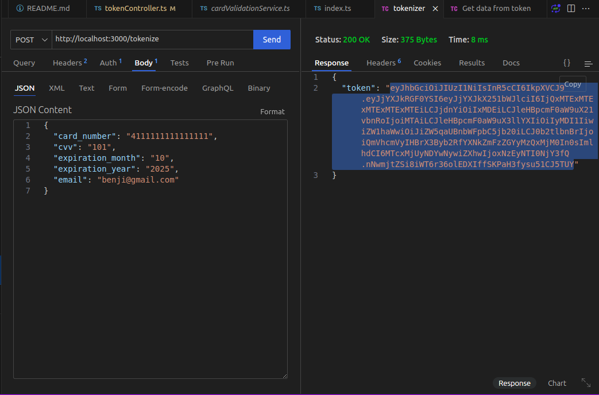
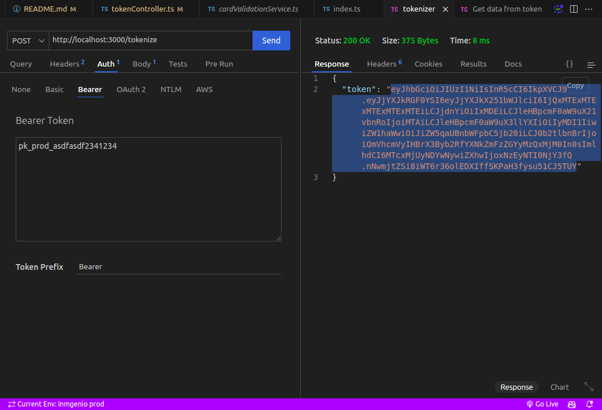
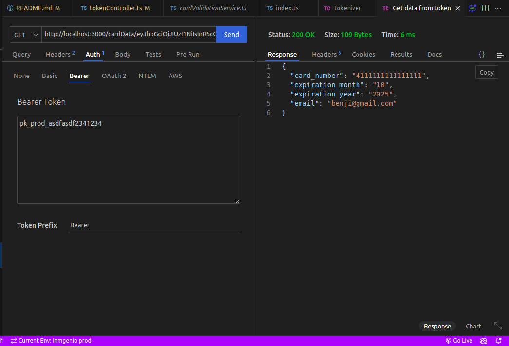

# Prueba Técnica

Aplicación para demostrar conocimientos en las técnologías: typescript, node, jwt, redis.

La aplicación genera un json token a partir de los datos de una tarjeta bancaria.

La aplicación permite obtener datos de una tarjeta a partir de un token.

## Tabla de Contenidos

* Instalación
* Uso

## Instalación

Proporciona instrucciones sobre cómo instalar y configurar el proyecto. Incluye todos los requisitos previos necesarios y los pasos específicos para la instalación. (Para el desarrollo de la aplicación se uso node 18, crear el `.env` con su propia configuración)

Ejecutar en consola:

```
npm i
```

## Uso

Para poder usar la aplicación, se necesita generar el empaquetado, y luego levantar el proyecto:

Ejecutar en consola:

```a
npm run build
npm run start
```

En mi caso en el `.env` configure el puerto 3000 así que las peticiones se harán en la url: `http://localhost:3000/`.

Ahora se podra probar el funcionamiento:

1. Generar Token





2. Obtener Datos del token



---
